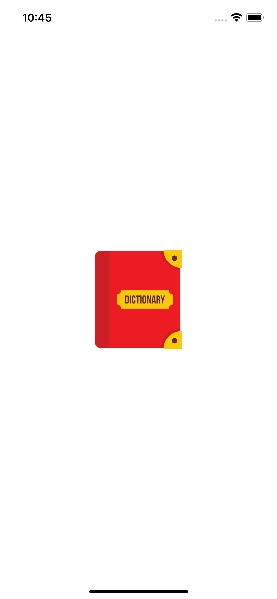

# Word Book
Flutter Mobile Application for Android/IOS

Your normal Dictionary, with audio and many many sentences for you to fully understand the word.

# Concepts Used:
- OOP
- Animations
- Widgets Seperation
- Widgets reutilization
- Using Andoird/iOS Platform-Specific Widgets 

# Packages/Tools used:
- HTTP
- AudioPlayers
- SVG images
- Icon Creation for Android/IOS
- Splash Screen creation for Android/iOS
